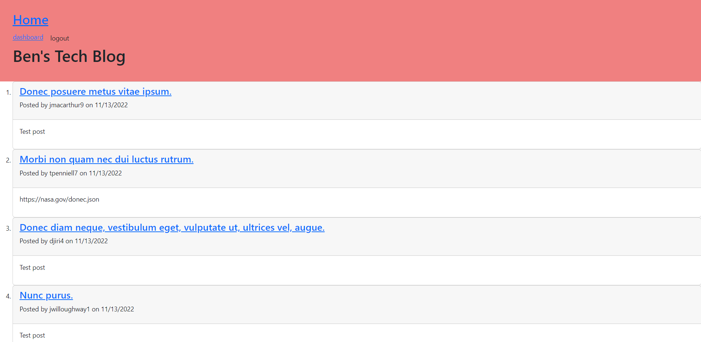

# 14-Model-View-Controller-Assignment

## Description
this is a full stack application where users can view, create, edit, and delete posts as well as comment on other posts. 

## Deployed application
https://hidden-meadow-87204.herokuapp.com/

## screenshot

## Built With
- JavaScript
- SQL
- NodeJS
- express.js
- mysql2
- Sequelize
- express-handlebars
- express-session
## Questions

If you have any questions, please contact at [GitHub/BenS213](https://github.com/BenS213/).